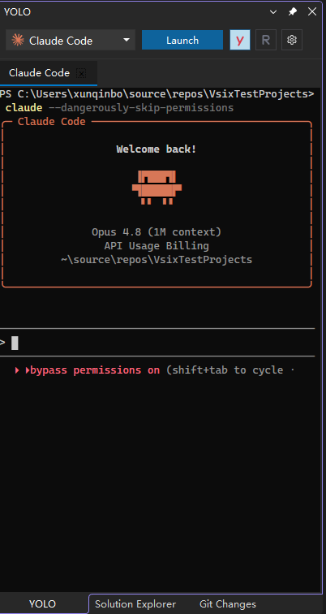

# YOLO for Visual Studio

YOLO is a Visual Studio extension that acts as a bridge between the IDE and your AI coding agents. From a docked tool window you launch agents such as Claude, Copilot, Gemini, or Cursor directly inside a real terminal, and steer them with Y (skip permission) / R (resume session) toggles — so the agent runs where your code already lives, with its output and working directory rooted in the current solution.

Install range is `[17.0, 19.0)`, so it covers both **Visual Studio 2022** and **Visual Studio 2026**. It is developed and debugged against VS2026 Community.

## Features

- **Right-side tool window**: a YOLO window docked next to the Solution Explorer. Open it from the top-level **YOLO** entry on the **View** menu, or press **Ctrl+W, Y**.
- **Data-driven agent dropdown**: lists the agents found in `agents.json` (Claude, Copilot, Gemini, Cursor, etc.), kept separate from code — add an agent by editing the JSON, not the source.
- **Y (skip permission) / R (resume session) global toggles**: sticky, persisted across sessions. At launch they append the agent's skip/resume flag (or inject a skip env var, e.g. `GOOSE_MODE=auto`) — they never touch already-running sessions.
- **Real multi-tab ConPTY terminal**: each Agent launch opens a fresh tab backed by a hand-drawn ConPTY (not WebView2 / Windows Terminal control). Multiple Agent sessions run concurrently; every tab has a close button, and text selection / copy work inside the TUI.
- **Tab switcher**: when more than one terminal tab is open, a compact chevron button appears at the right end of the toolbar and opens a tab-list popup to jump between sessions.
- **Keyboard capture**: the terminal keeps keyboard focus (click to capture; Esc / Ctrl+C work as expected).
- **Settings page** (`Tools > Options > YOLO`): edit agent flags, custom tools, and icons. Icons are validated as real images, and network icon URLs are downloaded to a local cache.
- **Installed-agent cache**: the detected agent set is persisted and only re-scanned in the background when it changes.

## Screenshot



## Tech stack

- **Extension skeleton**: `Microsoft.VisualStudio.SDK` `17.0.31902.203` (`AsyncPackage`)
- **UI framework**: WPF (tool window content, themed via `EnvironmentColors` / `VSColorTheme`)
- **Target framework**: `net472` (maximizes compatibility with the VS Shell / COM interop)
- **Debug target**: Visual Studio 2026 (v18), launched via the VSIX experimental instance with F5
  - The v17-referenced assemblies resolve against the v18 runtime through VS's binding redirects.
- **Terminal**: a hand-drawn ConPTY implementation (`Terminal/`) — selected over hosting Windows Terminal's control during the original spike.

## Directory structure

```
yolo-vs/
  Yolo.csproj                 # SDK-style project file (net472)
  Yolo.sln                    # Solution
  Yolo.vsct                   # Command table: View menu + Ctrl+W,Y
  source.extension.vsixmanifest  # VSIX manifest (InstallationTarget [17.0,19.0))
  YoloPackage.cs              # AsyncPackage entry point
  YoloToolWindowCommand.cs    # View-menu command (toggles the tool window)
  Constants.cs                # Constant definitions
  agents.json                 # Agent metadata (embedded resource)
  Resources.resx / Resources.Designer.cs  # Localization resources
  Properties/AssemblyInfo.cs

  ToolWindow/
    YoloToolWindowPane.cs     # ToolWindowPane
    YoloPanel.xaml(.cs)       # Panel UI (agent dropdown + Y/R toggles + tab switcher + multi-tab terminal)

  Terminal/                   # Hand-drawn ConPTY terminal (no WebView2 / HwndHost)
    ConPty.cs                 # CreatePseudoConsole / ResizePseudoConsole / Close P/Invoke
    ConPtyTerminal.cs         # Process + PTY lifecycle, pending command/env buffering
    TerminalEmulator.cs       # VT/ANSI escape-sequence parsing
    TerminalSurface.cs        # Hand-drawn text grid (cell metrics)
    WpfTerminalView.xaml(.cs) # WPF host control
    TerminalPalette.cs / CharWidth.cs / ITerminalView.cs / Logger.cs

  Links/                      # Terminal-output link detection (present, not yet wired into the main flow)
    YoloLinkPatterns.cs       # Regex patterns
    YoloHyperlink.cs          # Link model (LinkMatch / LinkTarget / LinkKind)
    FileLinkFilter.cs         # File-path links
    StackTraceLinkFilter.cs   # Stack-frame / bare file-name links
    TypeLinkFilter.cs         # Type-name links
    MemberLinkFilter.cs       # Class.member links
    UrlLinkFilter.cs          # URL links
    OutputLinkInterceptor.cs  # Output interceptor entry point

  Agents/
    AgentRegistry.cs           # Loads and queries agents.json
    AgentDetector.cs           # PATH + --version probing
    InstalledAgents.cs        # Installed-set cache + background re-scan
    AgentIconImage.cs          # SVG/PNG icon rendering
    DefaultSkipEnvs.cs        # env-style bypass (e.g. GOOSE_MODE=auto)
    ExecutableNames.cs         # Executable-name normalization

  Options/
    YoloOptionsPage.cs         # DialogPage (Tools > Options > YOLO > Agents)
    YoloOptionsControl.xaml(.cs)
    YoloSettingsDialog.xaml(.cs)
    YoloSettings.cs            # Persistence (XmlSerializer, at %LocalAppData%/YoloVS/settings.xml)
    AgentModels.cs             # Settings-page data model

  Resources/                  # Brand tile + icons
    pluginIcon.png / pluginIcon.svg / pluginIcon_dark.svg
    icons/agents/*             # Per-agent icons
    icons/skipY*, resume*      # Y/R toggle icon geometry
```

## Build

```bash
# Build with the .NET CLI (name the csproj explicitly — the repo has several sln/csproj files)
dotnet build Yolo.csproj -c Debug
# Output: bin/Debug/net472/Yolo.vsix

# Or use Visual Studio: open Yolo.sln and press F6.
```

## Debug

1. Open `Yolo.sln` in **Visual Studio 2026**.
2. Press **F5** to launch the VS2026 extension experimental instance and load this extension.
3. Open the tool window via the top-level **YOLO** entry on the **View** menu, or **Ctrl+W, Y**.
   - Settings: `Tools > Options > YOLO` (corresponds to `YoloOptionsPage`).
4. Pick an agent and launch — it runs as a live process inside a new terminal tab.

> After editing `Yolo.vsct` or `source.extension.vsixmanifest`, reset the experimental instance before F5 so the command table is rebuilt from the registry. (See `AGENTS.md` for the exact `CreateExpInstance /Reset` command — it requires the `18.0_9602cece` instance suffix.)
